Alex Huang
2016-07-18

Computational Economics Project - Bitcoin Price Analysis
========================================================

------------------------------------------------------------------------

Abstract:
---------

Since the inception of Bitcoin in 2011, the price has fluctuated significantly. The price boomed in late 2013 with prices raising up to $1000 in weeks and a bust subsequent loosing 80% of its value at the peak. This project aims to investigate the correlation between Bitcoin price and stocks and fitting an ARIMA model of the Bitcoin price and find the bounds of the Bitcoin price for the next three months.

Introduction
------------

This project contains two parts; the fist part investigate the correlation between Bitcoin price and S&P500; the second part fits an ARIMA model to Bitcoin price and find the bounds of the Bitcoin price for the next six months. In the first part, a cross correlation of the Bitcoin price and S&P500 is computed up to 20 lags; and a Granger causality test is performed on the two sets of data to investigate the causality relationship. In the second part, the autocorrelation coefficients and partial autocorrelation coefficients are calculated and an ARIMA model based on these coefficients is fitted to the Bitcoin price and a prediction is made for the next six months. This project is made in R and this document is made in R markdown.

------------------------------------------------------------------------

Part One Correlation between Bitcoin price and S&P 500
------------------------------------------------------

### Hypothesis

Since both stock and Bitcoin are financial assets that are highly volatile, there should be a cross correlation between Bitcoin price and S&P500 price. And the total asset of S&P500 is much bigger than the total asset amount of Bitcoin, it likely that the price of S&P500 Granger cause the price of Bitcoin, and price of Bitcoin does not Granger cause S&P500.

### Data Acquisition

<span style="color:maroon"> S&P500 <span>

The S&P500 data is downloaded from the following link <https://www.quandl.com/data/YAHOO/INDEX_GSPC-S-P-500-Index>

``` r
# the S&P500 data is read here and formatted
require(xts)
require(timeSeries)
require(Quandl)
stock=Quandl("CHRIS/CME_SP1", start_date="2011-09-18")
stock=as.xts(as.numeric(stock$Last), order.by=as.Date(stock$Date))
stock=stock[complete.cases(stock)]
weeklystock = apply.weekly(stock, mean)
```

<span style="color:maroon"> Bitcoin <span>

The Bitcoin price data is downloaded from the following link <http://api.bitcoincharts.com/v1/csv/bitstampUSD.csv.gz>

``` r
# This part formats the bitcoin data, converts the Unix time to yyyy-mm-dd format
raw = read.csv("./data/bitcoin.csv", header=FALSE)
names(raw)=c("unixtime", "price", "amount")
raw$date <- as.Date(as.POSIXct(raw$unixtime, origin="1970-01-01"))
```

<span style="color:maroon"> Finding Daily Bitcoin Price <span>

Since the S&P500 is closed on weekends and holidays, there is no data for some days. Where as Bitcoin is traded everyday, there is data for Bitcoin price everyday. There are two methods to solve this problem, the first one is to use the existing S&P500 data to estimate the days that are missing. The second is to simply aggregate both data set to a weekly basis and perform the test from there. I chose to use to second method, as it does not create artificial data.

Below are the plots of the weekly S&P500 data and the weekly Bitcoin data.

``` r
# All the transcation is shown when the data is downloaded, 
# but we only need the average daily price, here the data is aggregated
raw = aggregate(price~date, data=raw, FUN = mean)

#The Bitcoin price data is changed to a weekly basis here.
data <- as.xts(raw$price,order.by=as.Date(raw$date))
weeklybitcoin <- apply.weekly(data,mean)
```

``` r
plot(weeklystock)
```

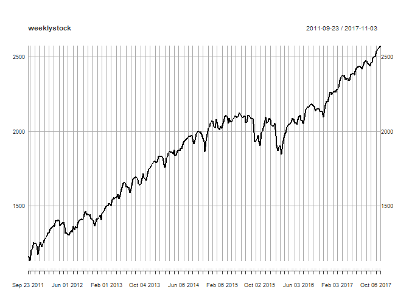

``` r
plot(weeklybitcoin)
```

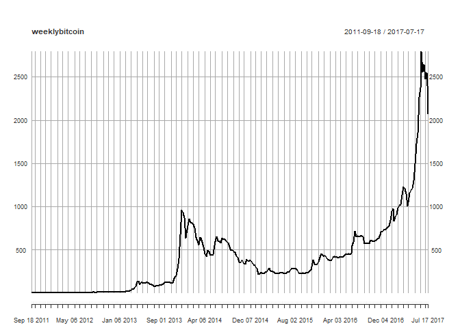

### Finding the Cross Corelation up to 20 LAG

The following graph shows a lag correlogram between Bitcoin price and S&P500 price on a weekly basis

``` r
#the two time series are trim to have the same length
weeklystock = weeklystock[(length(weeklystock)-length(weeklybitcoin)+1):length(weeklystock),]

weeklybitcoin=as.ts(weeklybitcoin)
weeklystock=as.ts(weeklystock)

#compute cross corelation of up to 20 lag
ccf(weeklybitcoin, weeklystock, lag.max = 20)
```

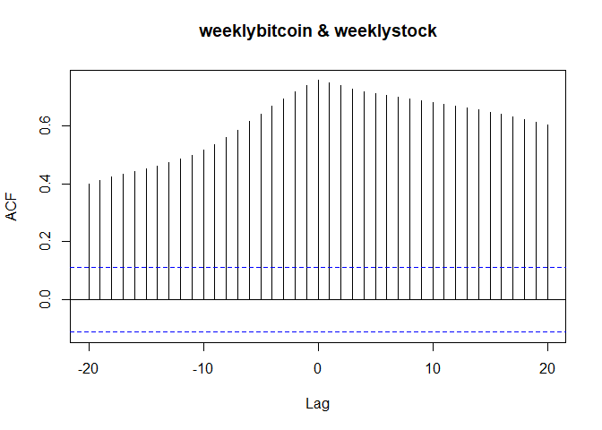

As we can see, the two time series are significantly correlated. This makes economic sense as both stocks and Bitcoin are perceived as high risk investments, when investors risk appetite increases, price of both stock and Bitcoin are likely to go up at the same time. The correlation starts to decrease as the absolute value of the lag increases.

### Finding Causality

The test for Granger Causality is preformed between the weekly Bitcoin data and the weekly S&P500 data. Granger test is a test to see whether including past data of another series and improve the prediction of the model.

``` r
require(lmtest)
#weekly = weekly[(length(weekly)-length(result$trend$bitcoin.)+1):length(weekly)]

#test for Granger causality
test =  grangertest(weeklybitcoin~weeklystock , order=1)
test2 =  grangertest(weeklystock~weeklybitcoin , order=1)
```

After performing a Granger we got a P value of 0.277 for S&P500 Granger causing Bitcoin price and a P value of 0.308 for Bitcoin price causing S&P500. Since the are both high than 0.05, we cannot reject the null hypothesis that changing in the value of one time series does not cause a subsequent change in the other. (The values might change as time goes on)

### Result

Although the price of Bitcoin and S&P500 are highly correlated, there seems to be no causal relationship between each other.

------------------------------------------------------------------------

Part two ARIMA analysis for Bitcoin
-----------------------------------

In part two, an ARIMA model is fitted to the Bitcoin price data. And a prediction bound is made for the Bitcoin for the next three months.

``` r
bitcoints=ts(raw$price, start=c(2011.75), frequency =365.25)
plot.ts(bitcoints)
```

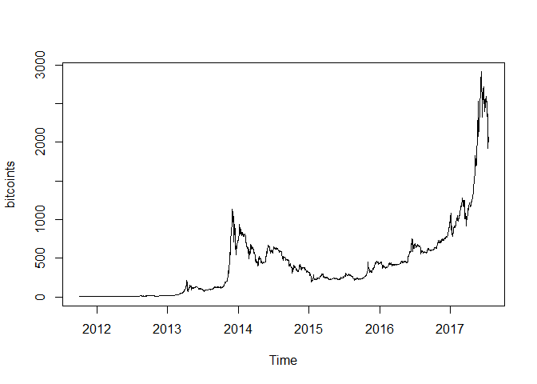

The Bitcoin data is clearly no stationary, we must first try to find a way to make the data stationary

### HP filter

``` r
#HP decomposition of the Bitcoin data. A frequency of 100*365^2 is used 
# for daily data
require(mFilter)
bitHP=hpfilter(bitcoints, freq = 100*365^2)
plot(bitHP$trend, ylab='Trend')
```

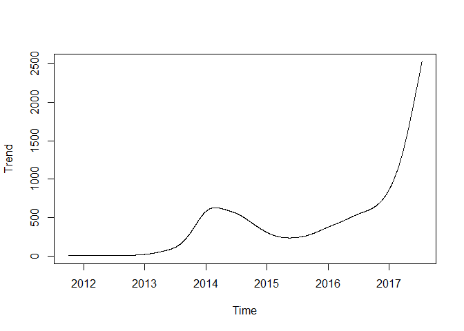

``` r
plot(bitHP$cycle, ylab='Cycle')
```

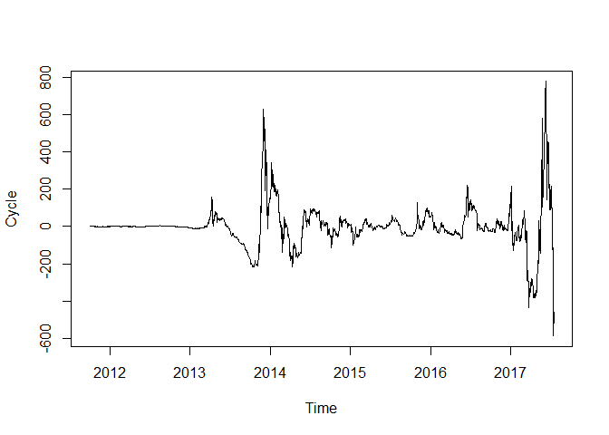 First, we try to use HP filter to see if the Bitcoin price has a trend component. The result shows a clear negative. The trend components also has a variance that changes over time. The HP filter does not seem to be applicable to this data set.

### ARIMA Model Fitting

Next we can try to difference the data to see if the change in Bitcoin price is a stationary serie. Both first difference and second difference is computed for the Bitcoin price.

``` r
#Differencing the bitcoin data
require(forecast)
bitdif1=diff(bitcoints, differences = 1)
plot.ts(bitdif1, ylab='First_Difference')
```

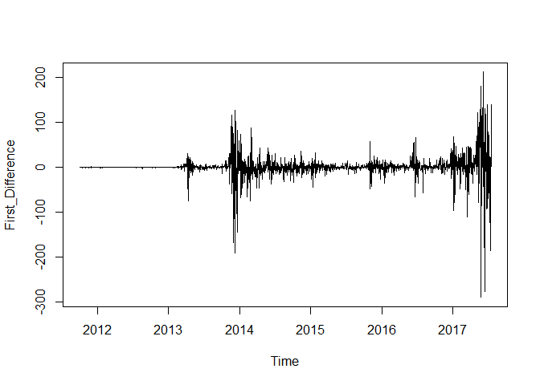

``` r
#Second Difference the Bitcoin Data
bitdif2=diff(bitcoints, differences = 2)
plot.ts(bitdif2, ylab='Second_Difference')
```

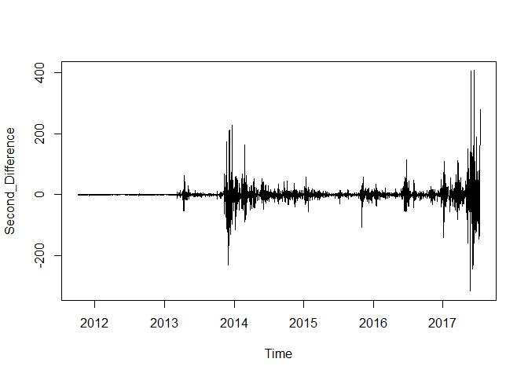

As we can clearly see the mean seems to be stationary across time, however the variance spiked significantly around the end of 2013. The graph below shows the autoregression coefficient and the partial autoregression coefficient of the first difference of the Bitcoin price. One can see that many coefficient significantly exceeds the 95% confidence interval bound. If this model is used to predict the price bound, it will need to take into account too many terms.

``` r
# Find the ACF and PACF of the Bitcoin data
acf(bitdif1, main='First Difference')
```

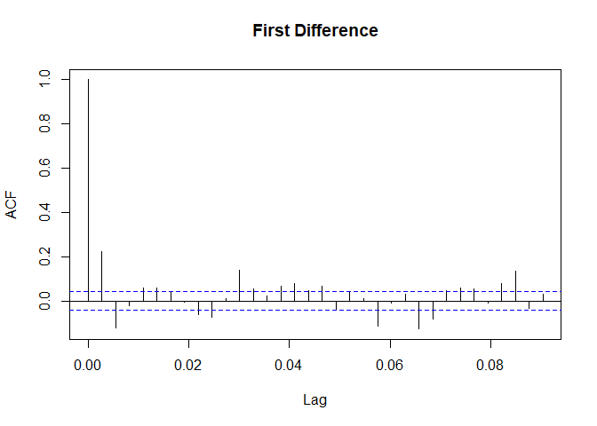

``` r
pacf(bitdif1, main='First Difference')
```

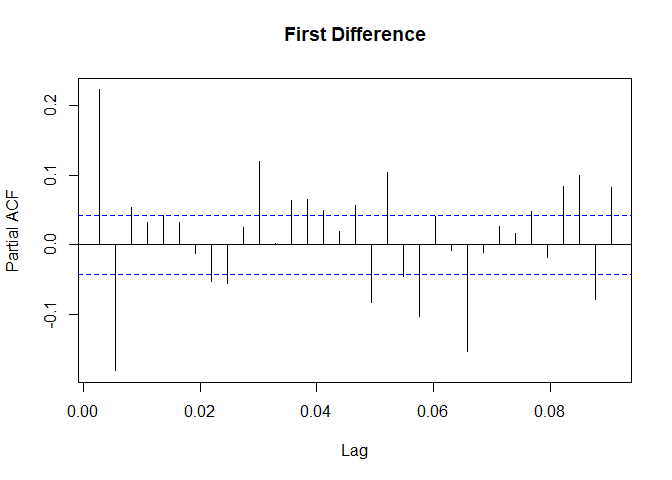

Instead, we should try to use the Bitcoin data after the bust of 2014 bubble, this set of data might give us better prediction. Because there is almost no change in Bitcoin price before the bubble, and large volatility during the bubble; these data are probably extreme outliers that should not be included in the ARIMA model fitting. Here we will cut the data and only use the time series from the second half of 2014 (after the crash of the bubble).

``` r
#Cut the bitcion data to remove the bubble part
bitcoincut = window(bitcoints, c(2014.5), end(bitcoints))
plot.ts(bitcoincut)
```

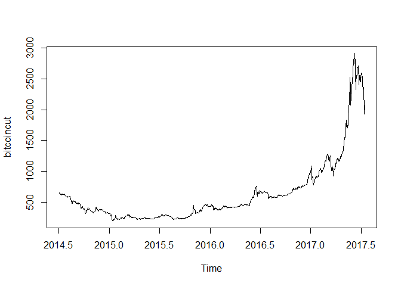

``` r
#Difference the data again
bitcutdif1=diff(bitcoincut, differences = 1)
plot.ts(bitcutdif1, main="First Difference of Cut Series")
```

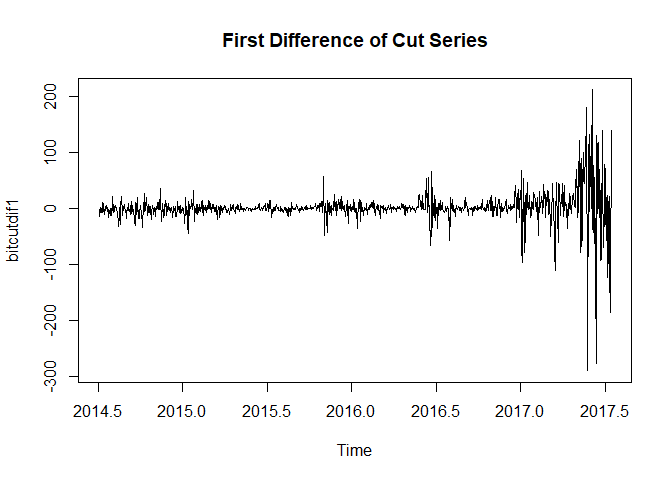

The first differenced data here seems much more stationary with much small change in variance throughout time.

``` r
#Find ACF and PACF of the difference cut data
acf(bitcutdif1)
```

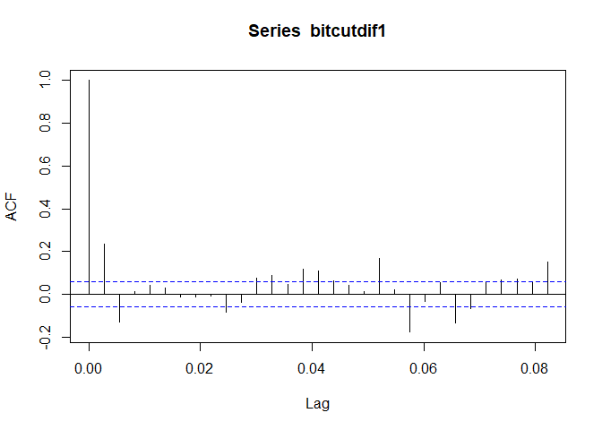

``` r
pacf(bitcutdif1)
```

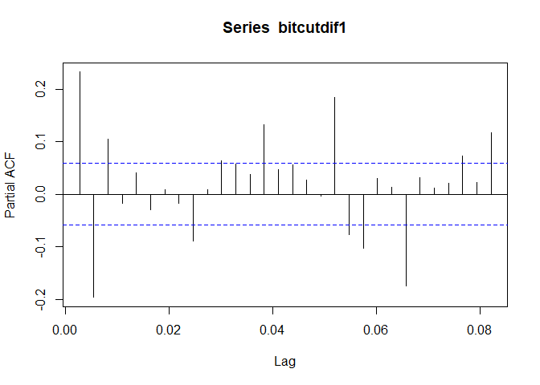 We can see that the the autoregression coefficient (ACF) and the partial autoregression coefficient (PACF) decays within the 95% confidence bound much quicker. This is the set of data we can use to fit the ARIMA model. The second differenced data is also plotted below, but it does not seem to improve the stationarity of the data. Therefore we will use the first differenced data.

``` r
#plot the second difference of the cut data
bitcutdif2=diff(bitcoincut, differences = 2)
plot.ts(bitcutdif2)
```

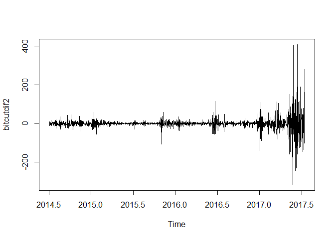

Because we decided to use the first differenced data, we selected d=1 in the ARIMA(p,d,q) model.

Next task would be select the q and p value. We see that in the ACF graph above, the first lagged coefficient significantly exceeded the confidence interval, while the second and ninth one slightly exceed the confidence interval. The second and ninth one might vary well be due to chance. Since we are looking at many coefficients, it is highly likely that one or two are above the bound when it is not supposed to. To keep the model simple we pick p=1

In the PACF graph first lagged and second lagged partial autoregression coefficient exceeds the confidence interval significantly. The others are likely due to chance. We apply the same methodology in picking p, and choose q=2

Now that we have all the variables we will be fitting a ARIMA(2,1,1) model to the Bitcoin price data. An ARIMA(2,1,1) model is the same as ARMA(2,1) on the first differenced Bitcoin price data.

### Results

``` r
#Find the confidence interval moving forward in Bitcoin price
arorder=auto.arima(bitcoincut, ic="bic")
bitcoinarima=arima(bitcoincut, order=c(2,1,1))
bitcoinforcast=forecast(bitcoinarima, h=180)
plot(bitcoinforcast)
```

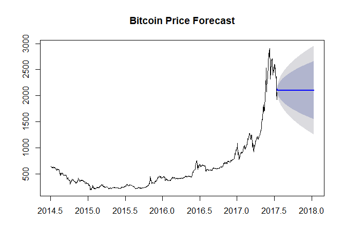

In the graph above, the deep blue area indicates where the Bitcoin price will be with 80% confidence, whereas the light blue area indicates with 95% confidence interval.

To see if our model is reasonable, we cut part of the Bitcoin data from 2016-01-01 and see if the subsequent price lies within the bound we predicted.

``` r
#predict the price of Bitcoin in 2016 using 2014 - 2015 data
bitcoinoneyear= window(bitcoincut, start(bitcoincut), c(2016))
bitcoinarima=arima(bitcoinoneyear, order=c(2,1,1))
bitcoinforcast=forecast(bitcoinarima, h=270)

# plots both forcast and the actually bitcoin price
plot(bitcoinforcast)
lines(bitcoincut)
```

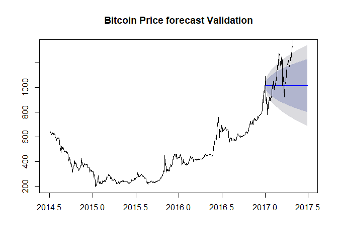

For the most part the price seem to lies within the 95% confidence interval, however it did over shoot the interval slightly around May 2016. This can be caused by not taking some of the coefficients from before, or another bubble in Bitcoin forming.

------------------------------------------------------------------------
