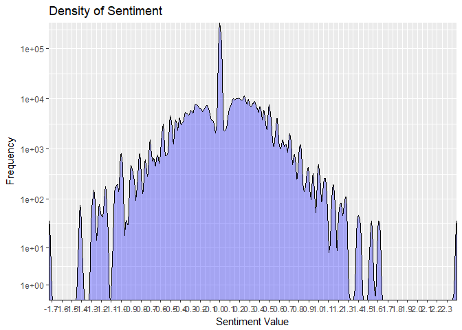

Does Time of the day and Week Influence Happiness?
================

Overview
--------

In this project I want to find out how people's mood oscillates through out the day and through out the week. I will be using Twitter archive data and perform sentiment analysis on the tweet content to see how people's mood oscilliated.

The following packages from R is required to run the Rmd file:

``` r
install.packages('streamR')
```

I will be only using the Twitter archive data from 2011/10/24 to 2011/10/30 and selecting the tweets from the UK and in english language. The reason I am only using data from 1 week is to reduce the run time (It already takes a few hours to download and process the data). I am aware of the fact that this might be a special week and the conclusion might be biased to the events that happened this week (ie. politics, economy, weather). The reason I am only using UK data is because I will be analysing how people's oscillates each hour. Having the whole country in the same timezone is very important in this respect.

Part 1: Download Data
---------------------

All the data is downloaded from <https://archive.org/details/archiveteam-json-twitterstream> which is a archive of old tweets. As this part takes some time to run. A csv file of cleaned and parsed data is also included if part 1 is to be skipped.

Download Data from <https://archive.org/details/archiveteam-json-twitterstream> download for 2011/10/24 to 2011/10/30

``` r
dir.create("data")
for(i in 23:30){
  URL = paste("https://archive.org/download/archiveteam-json-twitterstream/twitter-stream-2011-10-",i,".zip", sep="")
  download.file(URL, destfile = "./data/twitter.zip")
  unzip("./data/twitter.zip", exdir="./data")
}
```

Read the tweets file by file and only keep the ones from the UK and in English. It takes some time to run. The result is written to a csv file to avoid the need to run this part in the future.

``` r
require(streamR)


tweets = data.frame()

for(i in 23:30){
  for(j in 0:23){
    for(k in 0:59){
      
      if(j<10&&k<10){
        directory = paste("./data/", i, "/0", j, "/0", k, ".json.bz2", sep="")
      }else if(j<10){
        directory = paste("./data/", i, "/0", j, "/", k, ".json.bz2", sep="")
      }else if(k<10){
        directory = paste("./data/", i, "/", j, "/0", k, ".json.bz2", sep="")
      }else{
        directory = paste("./data/", i, "/", j, "/", k, ".json.bz2", sep="")
      }
      
      if(!file.exists(directory)){
        next
      }
      temp = parseTweets(directory)
      temp = temp[!is.na(temp$country_code)&temp$country_code=="GB"&temp$user_lang=="en",]
      
      tweets = rbind(tweets, temp)
    }

  }
}


#str <- strptime(gbtweets$created_at[1], "%a %b %d %H:%M:%S %z %Y", tz = "UTC")
write.csv(tweets, file = "tweets.csv",row.names=FALSE, na="")
```

Part 2 Analysis
---------------

If the Tweets from the UK has already been extracted and saved as 'tweets.csv', then start the project from there. Analyze the sentiment of the tweets using qdap package, each tweet is broken into sentences and fed to QDAP to perform sentiment analysis. QDAP returns a number which represent the sentiment of the text. A possitive value represents positive sentiment and vice versa for negetive value. The absolute value of the sentiment value represents the strength of the sentiment.

``` r
require(qdap)
tweets=read.csv("tweets.csv", header = TRUE, stringsAsFactors = FALSE )
#take a look at the first few lines of tweets
head(tweets$text)
```

    ## [1] "Used car recently added: #NISSAN #NAVARA only £5980 http://t.co/MYU4CFeG"                            
    ## [2] "Hey Monday"                                                                                          
    ## [3] "Horrible, horrible nightmare. Also, my alarm is a bastard."                                          
    ## [4] "@BeeStrawbridge a day to disconnect and reconnect to what's important - an excellent idea. Thank you"
    ## [5] "Used car recently added: #VOLKSWAGEN #GOLF only £695 http://t.co/lsGgIVEN"                           
    ## [6] "http://t.co/whsQJLMQ"

Here are the first few tweets of the day. Good, We spotted one negative(\#3) and one positive(\#4) tweets already

``` r
#create data frame
tweets=data.frame(time=tweets$created_at, text=tweets$text, sentiment=NA, postw=0, negtw=0, tottw=1)

#Detect sentiment for each tweet
for(i in 1:nrow(tweets)){
  #Some tweets have no words which would cause error with polarity()
  #Therefore the try function
  sentiment = try(polarity(sent_detect(tweets$text[i])))
  if(class(sentiment)=="try-error"){
    tweets$sentiment[i]=NA
  }else{
    #sentiment is assigned value returned from polarity() function
    tweets$sentiment[i]=sentiment$group$ave.polarity
    if(is.nan(sentiment$group$ave.polarity)){
      next
      
    #0.3 is also used as classification threshold for future applications
    }else if(sentiment$group$ave.polarity>0.3){
      tweets$postw[i]=1
    }else if(sentiment$group$ave.polarity<(-0.3)){
      tweets$negtw[i]=1
    }
  }
}

#remove tweets that qdap() cannot distinguish
tweets=tweets[!is.nan(tweets$sentiment)&!is.na(tweets$sentiment),]


head(tweets[,c('text', 'postw', 'negtw')])
```

    ##                                                                                                   text
    ## 1                             Used car recently added: #NISSAN #NAVARA only £5980 http://t.co/MYU4CFeG
    ## 2                                                                                           Hey Monday
    ## 3                                           Horrible, horrible nightmare. Also, my alarm is a bastard.
    ## 4 @BeeStrawbridge a day to disconnect and reconnect to what's important - an excellent idea. Thank you
    ## 5                            Used car recently added: #VOLKSWAGEN #GOLF only £695 http://t.co/lsGgIVEN
    ## 6                                                                                 http://t.co/whsQJLMQ
    ##   postw negtw
    ## 1     0     0
    ## 2     0     0
    ## 3     0     1
    ## 4     1     0
    ## 5     0     0
    ## 6     0     0

It seeems that tweet 3 and tweet 4 are both correctly classified as negative and positive respectively. Great!

Now convert the data frame to a time serie and average the sentiment by hour and by day and plot the results

``` r
require(xts)
qdap = as.xts(cbind(tweets$postw, tweets$negtw, tweets$tottw), order.by=strptime(tweets$time, "%a %b %d %H:%M:%S %z %Y", tz = "UTC"))
#sum over hour
qdaphr = period.apply(qdap["2011-10-26"], endpoints(qdap["2011-10-26"], "hours", 2), colSums)
#sum over day
qdapdl = apply.daily(qdap["2011-10-24/2011-10-30"], colSums)
index(qdapdl) = as.Date(index(qdapdl))

#plot positive sentiment and negetive sentiment tweets as a percent of total tweets over a day
plot(as.zoo(cbind(qdaphr[,1]/qdaphr[,3], qdaphr[,2]/qdaphr[,3])), main="Hourly Twitter Sentiment", col=c("red", "blue") ,ylab=c("positive", "negative"),ylim=c(0, 0.15))
legend(x = "bottomright", legend = c("Positive", "Negative"), lty = 1,col = c("red", "blue"))
```



``` r
#plot positive sentiment and negetive sentiment tweets as a percent of total tweets over a week
plot(as.zoo(cbind(qdapdl[,1]/qdapdl[,3], qdapdl[,2]/qdapdl[,3])), main="Daily Twitter Sentiment", col=c("red", "blue") ,ylab=c("positive", "negative") )
legend(x = "bottomright", legend = c("Positive", "Negative"), lty = 1,col = c("red", "blue"))
```


Conclusion
----------

We can clearly see a big dip in both positive and negative tweets aroung 7:00. Positive tweets spike around 17:00 (finished work), and negative tweets spike aroung midnight.

Over the week, people are happier close to the weekend and are quite negative on Sunday. This can be explained by expectation theory. On Friday, people have the weekend to look forward to where as on Sunday, people are already seeing themselves waking up early on Monday and going to work.
